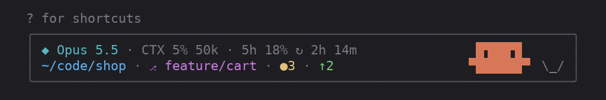

# clawd-statusbar

A status bar for [Claude Code](https://claude.com/claude-code) that sits in a thin frame under the prompt, with Clawd, the little creature from Claude Code's welcome screen, frying an egg on the right while Claude works.



<sub>One turn, time-lapsed: the egg cracks in, sizzles while the yolk sets, and is served with a ✓; the pipeline goes from running to passed.</sub>

## What it shows

**First line: the session**

| | |
|---|---|
| `◆ Opus 5.5` | the model |
| `CTX 5% 52k` | how full the context window is, in percent and tokens |
| `5h 18% ↻ 2h 14m` | the 5-hour usage limit and when it resets |
| `7d 62% ↻ 4d 17h` | the weekly limit, only once it is half used |
| `CPU 85%` · `RAM 91%` | only when 80% or higher, when they would explain a slow run |

**Second line: the project**

| | |
|---|---|
| `~/code/shop` | the project's folder |
| `⎇ feature/cart` | the branch (dropped whole when it does not fit, never cut in half) |
| `●3` | files with uncommitted changes |
| `↑2` `↓1` | commits not pushed, and not pulled |
| `≡1` | stashes |
| `worktree name` | when the session runs in a linked git worktree |
| `⚠ rebasing 2/5` | git stopped partway: a rebase, merge, cherry-pick, revert or bisect |
| `!171 ✓` `#12 ✗` `CI ◔` | the branch's open GitLab MR or GitHub PR and its pipeline: green passed, red failed, yellow running; `CI` when there is a pipeline but no open MR |

Everything that is not always useful appears only when it applies, so most of the time the bar is short. On a narrow terminal, items that do not fit are left out whole.

**Clawd** fries an egg through each turn: he cracks it into the pan, flips it while it sizzles, and the yolk sets as the turn runs long (`o`, then `◉` after 10 seconds, `●` after 30). When the turn ends he holds it up with a green `✓`, or a red `x` if the turn was interrupted or failed. Between turns he blinks over an empty pan. He steps aside on terminals narrower than 72 columns.

## Install

In Claude Code, type:

```
/plugin install clawd-statusbar --marketplace itsomidho/clawd-statusbar
```

Answer `y` to add the marketplace, then choose a scope. The bar appears right away; no restart.

`/statusbar` turns it off and on.

## Requirements

- Linux or macOS, with `bash`, `jq` and `git`
- Optional: [`gh`](https://cli.github.com) (logged in) for GitHub PR and Actions status, or [`glab`](https://gitlab.com/gitlab-org/cli) (logged in) for GitLab MR and pipeline status, including self-hosted GitLab. Without them that item stays hidden.

## Settings

Open `/plugin`, pick clawd-statusbar, and set:

| Setting | Default | |
|---|---|---|
| Clawd | on | show the mascot |

## How it works

The figures come from one script, `scripts/statusline.sh`, which reads the session's JSON on stdin; the plugin (`hooks/register.tsx`) runs it every 5 seconds and draws the result. Anything that needs the network (the pipeline status, every 60 seconds) runs in the background and the bar shows the last answer, so a slow or unreachable server never holds it up.

The script also works on its own as a classic `statusLine` command in `settings.json`, drawing the same figures as plain lines.

## Development

```
claude plugin validate .
claude plugin test .
```

To run your working copy instead of the installed one, start Claude Code with `claude --plugin-dir /path/to/clawd-statusbar`; edits reload when a turn ends.

## License

MIT
